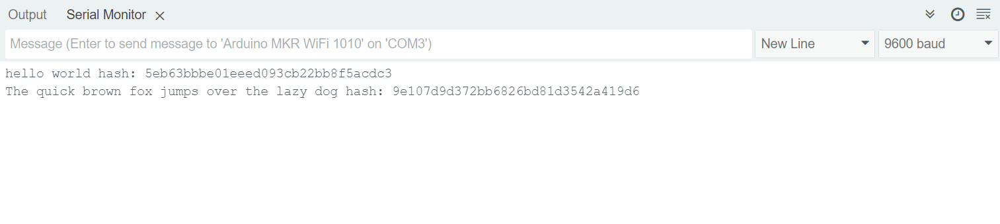

# Exercise 2

Ilmari Hämäläinen 894931
Ziqi Wang 101699682

## 1. Goal

The goal of this assignment is to help students gain hands-on experience with implementing hash functions for digital signatures, focusing specifically on MD5 and SHA-3. The purpose and motivation behind this experiment include:

- By implementing MD5 and SHA-3, we'll get a deeper understanding of how hash functions work, including their processes of converting variable-length messages into fixed-length outputs.

- The assignment aims to demonstrate the role of hash functions in digital signatures, showcasing how they contribute to the integrity and authenticity of digital communications.

- Through the implementation of both MD5 and SHA-3, the assignment encourages comparing and contrasting these two algorithms, understanding their strengths, weaknesses, and suitability for security applications.

- The questions in the assignment guide us to think critically about the security aspects of hash functions, their resistance to attacks, and the implications of a hash algorithm being "broken."

## 2. Experiment Setup

- Installing MD5 library to Arduino IDE
- Creating the sketch for MD5 use
- Testing the sketch

## 3. Results & Conclusion



Result of MD5 hash values of inputs "hello world" and "The quick brown fox jumps over the lazy dog".

## 4. Given questions

### Of the two mentioned hash function, would you use one for Security Application? Why? If not, provide an alternative

My choice is SHA-3 over MD-5.

MD5 has been found to be vulnerable to collision attacks, where two different inputs can produce the same hash output. This undermines the hash function's integrity and makes it unsuitable for applications where data security and integrity are paramount, such as in digital signatures, SSL certificates, and secure message transmission.

SHA-3 is part of the Secure Hash Algorithm family, developed to address the vulnerabilities found in earlier hash functions like MD5 and SHA-1. SHA-3 is based on the Keccak algorithm, which was selected through a public competition aimed at finding a robust hash function resistant to known types of cryptographic attacks. SHA-3 provides stronger security guarantees and is designed to be resistant to collision attacks, making it suitable for security-critical applications.

### Please explain in brief what makes hash functions resistant to attacks. Provide an exemplary brief case study

Hash functions are designed to be resistant to attacks through:

- It should be computationally infeasible to find any input which hashes to a given output. This means, given a hash value `h`, it should be extremely hard to find any message `m` such that `hash(m) = h`.

- Second Pre-image Resistance: Given an input `m1`, it should be computationally infeasible to find another input `m2 (m1 ≠ m2)` such that `hash(m1) = hash(m2)`.

- Collision Resistance: It should be very hard to find any two distinct inputs `m1` and `m2` such that `hash(m1) = hash(m2)`. It prevents attackers from substituting a legitimate message with a fraudulent one having the same hash.

Case study:

> The most famous cryptocurrency, Bitcoin, uses hash functions in its blockchain. Powerful computers, called miners, race each other in brute force searches to try to solve hashes in order to earn the mining rewards of new Bitcoins, as well as processing fees that users pay to record their transactions on the blockchain.
>
> Solving a hash involves computing a proof-of-work, called a NONCE, or “number used once”, that, when added to the block, causes the block’s hash to begin with a certain number of zeroes. Once a valid proof-of-work is discovered, the block is considered valid and can be added to the blockchain.
>
> Since each block’s hash is created by a cryptographic algorithm – Bitcoin uses the SHA-256 algorithm – the only way to find a valid proof-of-work is to run guesses through the algorithm until the right number is found that creates a hash that starts with the right number of zeroes. This is what Bitcoin miners are doing, running numbers through a cryptographic algorithm until they guess the valid NONCE.
> Source: [link](https://corporatefinanceinstitute.com/resources/cryptocurrency/hash-function/)

### Provide a comparison between MD5 and SHA-3. Overall, which one do you think performs better than the other one?

#### Security

- **MD5**: Has been proven vulnerable to collision attacks, where two different inputs can produce the same output hash. This vulnerability severely undermines its security, making it unsuitable for cryptographic security purposes.
- **SHA-3**: Offers a significantly higher security level, designed to be resistant to the vulnerabilities that affect MD5 and SHA-1. It's based on the Keccak algorithm, which was selected for its robust security features in a public competition.

#### Performance

- **MD5**: Generally faster than SHA-3, making it suitable for non-security critical applications like checksums for file integrity verification where high speed is desired.
- **SHA-3**: While secure, is typically slower than MD5 due to its more complex and secure algorithm. The performance difference, however, may not be significant for many applications, and SHA-3's security benefits often outweigh its slower speed.

#### Hash Length

- **MD5**: Produces a 128-bit hash output, which is shorter and thus less secure against brute-force attacks compared to longer hashes.
- **SHA-3**: Provides more flexibility with variable output lengths (224, 256, 384, 512 bits), allowing for stronger security levels suitable for various applications.

### What does it mean for a hash algorithm to be broken?

1. **Pre-image Resistance Break**: If it becomes feasible to find an input that hashes to a specific output with less effort than brute force, the algorithm is said to have a pre-image resistance break.

2. **Second Pre-image Resistance Break**: This occurs when, given an input and its hash, it's possible to find another input that produces the same hash, more efficiently than by brute force.

3. **Collision Resistance Break**: The hash function is considered broken in terms of collision resistance if it's possible to find two distinct inputs that produce the same output hash, more efficiently than brute force.

## Sketch
MD5 sketch
```
#include <MD5.h>

void setup()
{
  //initialize serial
  Serial.begin(9600);
  while (!Serial);
  //give it a second
  delay(1000);

  //MD5 hash
  Serial.print("The quick brown fox jumps over the lazy dog hash: ");
  unsigned char* hash=MD5::make_hash("The quick brown fox jumps over the lazy dog");
  //generate the digest (hex encoding) of our hash
  char *md5str = MD5::make_digest(hash, 16);
  free(hash);
  //print it on our serial monitor
  Serial.println(md5str);
}

void loop()
{
}
```
SHA3 sketch
```
#include <SHA3.h> 

void setup() {
  Serial.begin(9600);
  while (!Serial); 

  SHA3 sha3(256); 
  uint8_t *hashOutput;

  // input data for testing
  const char* input = "Hello, SHA-3!"; 

  sha3.doUpdate(input, strlen(input));  // Add data to be hashed
  hashOutput = sha3.doFinal();  // Finalize and get the hash

  for (int i = 0; i < sha3.hashSize(); i++) {
    Serial.print("0123456789abcdef"[hashOutput[i] >> 4]);
    Serial.print("0123456789abcdef"[hashOutput[i] & 0xf]);
  }
  Serial.println();
}

void loop() {
}
```