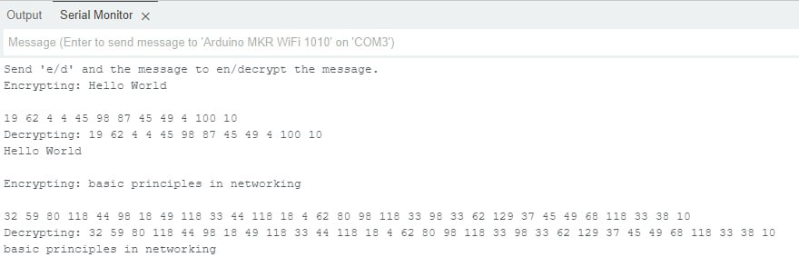

# Assignment I: Introduction to basic cryptography using Arduino

Ziqi Wang 101699682
Ilmari Hämäläinen 894931

## 1. Goals and motivations

The experiments is meant to:

- get us familiar with basic knowledge on how to program on a Arduino module
- help us understand the principles and implementations of different cryptography algorithms
- let student acquire valuable skills in programming and hardware interaction, which are applicable in a wide range of technology and engineering fields.
- encourage creativity us to explore various encryption schemas, such as base64, rot13 or RSA, and even leverage encryption libraries.

## 2. Experimental setup

- Installing and configuring Arduino IDE
- Creating the sketch
  - Choosing the cryptography algorithm (RSA)
  - Implementing the algorithm
  - Implementing the user input/output
- Testing the sketch

## 3. Result and conclusions

### 3.1 Experiment Outcomes

In conclusion, the experiment successfully demonstrated the implementation of RSA encryption and decryption on the Arduino MKR WiFi 1010 platform. Upon entering the plaintext message "Hello World" into the serial monitor, the Arduino sketch encrypted the message using the RSA algorithm, resulting in a ciphertext that was distinctly different from the original message. This encrypted message, when input back into the system, was successfully decrypted by the Arduino sketch, accurately reproducing the original plaintext message "Hello World" (Fig.1).


Fig.1

### 3.2 Challenges

- In order to transform `char` and `String` into numbers so that they can be encrypted using mathematical formulas, we used ASCII to map different characters to unique numbers. However, when we mapped the decrypted numbers back to `char` following the ASCII, some turned into messy code when the number is bigger than 127. So one solution is presenting encrypted texts as numbers. The drawback is that the server cannot receive strings as input encryption text.
- Implementing RSA encryption on an Arduino platform presented unique challenges, particularly due to the computational limitations and memory constraints of the device. Optimizing the sketch to accommodate the RSA algorithm required careful consideration of the key size and the efficiency of the code. This experiment underscored the importance of selecting appropriate cryptographic methods tailored to the capabilities of the hardware in use.

### 4. Sketch

```C
#include <Arduino.h>

// RSA parameters
const long e = 7;  // Public exponent
const long d = 103;  // Private exponent
const long n = 143;  // Modulus

void setup() {
  Serial.begin(9600);
  while (!Serial); // Wait for the serial port to connect
  Serial.println("Send 'e/d' and the message to en/decrypt the message.");
}

long encrypt(int msg) {
  int encrypted = 1;
  for (int i = 0; i < e; i++) {
    encrypted *= msg;
    encrypted %= n;
  }
  return encrypted;
}

int decrypt(int msg) {
  int decrypted = 1;
  for (int i = 0; i < d; i++) {
    decrypted *= msg;
    decrypted %= n;
  }
  return decrypted;
}

void loop() {
  if (Serial.available() > 0) {
    String command1 = Serial.readString(); //input 
    int indexOfSpace = command1.indexOf(' ');

    if (indexOfSpace != 1) {
      Serial.print("wrong input, give 'e/d {message}'");
    } else {
      String msg1 = command1.substring(indexOfSpace + 1);
      String option = command1.substring(0,1);

      if (option == "e") {
        Serial.print("Encrypting: ");
        Serial.println(msg1);

        for (int i = 0; i < msg1.length(); i++) {
          int encryptedChar = encrypt(msg1[i]);
          
          Serial.print(encryptedChar);
          Serial.print(" ");
        }
        Serial.println();
      } else if (option == "d") {
          char charArray[msg1.length() +1];
          int intArray[msg1.length() +1];
        
          Serial.print("Decrypting: ");
          Serial.print(msg1);
          int i = 0;
          int arrayCount = 0;
          while (i < msg1.length()) {
            int counter = i; // Start counter at current position of i
            while (counter < msg1.length() && msg1[counter] != ' ') {
              counter++; // Increment counter to find the next space or end of the string
            }
            // Extract the substring from i to counter
            String sub = msg1.substring(i, counter);
            intArray[arrayCount] = sub.toInt();
            char decryptedChar = decrypt(intArray[arrayCount]);
            Serial.print(decryptedChar);
            arrayCount++;
            i = counter + 1; // Move i to the position after the found space / end of the string
            
            while (i < msg1.length() && msg1[i] == ' ') i++; // Skip any additional spaces
          }

      Serial.println();
      } else {
        Serial.print("specify e/d");
      }
    }
  }
}
```
